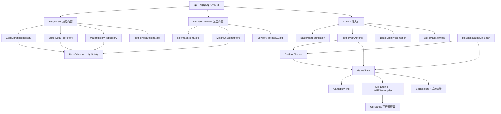

# P0 / P1 优化验收记录

验收环境：Godot 4.6.3 stable，Windows / WSL headless，2026-08-27。

## 当前架构

战场表现已永久收敛为纯 2D：`Main.tscn` 不包含 `Node3D`，操作、表现、联网与规则层不再经过 3D 功能开关或适配器。



## P0

### P0-1 UGC 安全预算

- 单次重复上限 20，技能效果嵌套深度 8，表达式深度 12。
- 每技能最多 100 个效果节点，每卡最多 200 个效果节点、3 个技能。
- 单次运行最多执行 200 个效果节点，触发链深度最多 16。
- 分享包最大 12 MiB。
- 编辑、导入、载入和战斗执行四条路径都必须拒绝超限内容，并给出可定位错误。

验收：`TestUgcSafety.tscn`、`TestDataSchema.tscn` 通过。

### P0-2 可复现战斗

- 所有影响玩法结果的随机行为使用可注入、可导出状态的 RNG。
- 相同初始状态、种子和操作序列必须得到相同逐步哈希与最终状态。
- 快照恢复后的后续结果必须与不中断运行一致。
- 回放记录必须能检测操作或状态篡改。

验收：`TestBattleRepro.tscn` 通过。

### P0-3 统一数据 Schema

- 卡牌、技能、卡组、牌库、分享包、草稿恢复、技能模板、战绩和战斗快照统一校验。
- 支持受控旧版本迁移，拒绝未来版本、错误类型、未知效果、过大及残缺数据。
- 原子写入，主文件损坏时从备份恢复，不能用默认数据覆盖用户数据。

验收：`TestDataSchema.tscn`、`TestPersistenceSafety.tscn` 通过。

## P1

### P1-1 战斗入口拆分

- `Main.gd` 只保留薄入口。
- 基础设施、操作、表现、联网职责分别放入独立层；单层不超过 1600 行。
- `GameState` 不依赖 UI 节点。

验收：`TestMainArchitecture.tscn` 通过；Godot 编辑器导入及 `Main.tscn` 独立启动通过。

### P1-2 全局与联网状态隔离

- 牌库、编辑器数据、战绩、战斗准备、房间会话、战斗快照和协议校验有独立服务。
- 单人、热座和在线模式连续切换时，不得泄漏上一模式的牌组、对手或编辑器状态。
- 断线重连恢复传输、房间身份、战斗快照并通知存活客户端。

验收：`TestGlobalStateIsolation.tscn`、`TestNetworkSafety.tscn`、`scripts/run_reconnect_integration.sh` 通过。

### P1-3 无 UI 批量模拟

- 使用正式 `GameState` 与 AI 决策核心，不复制战斗规则。
- 支持种子、双方牌组、AI 难度、先后手交换、回合上限。
- 1000 局内无崩溃、死循环和超过回合上限的对局，并输出 JSON / CSV 指标。

验收：`TestBattleSimulator.tscn` 通过。默认补偿校准后的独立 1000 局复验为平均 7.66 回合、0 稳定性失败、先手胜率 49.9%。

### P1-4 可解释 AI

- AI 统一执行“生成合法动作 → 评分 → 选择动作”，每个候选动作带分数和解释。
- 简单、普通、困难共享合法动作集合，只改变选择策略。
- 固定残局覆盖斩杀、嘲讽、交换、保留高价值单位、资源效率、治疗、增益和目标方向。

验收：`TestAiPlanner.tscn` 的 25 个固定残局全部通过。

### P1-5 响应式 UI

- 窗口允许自由缩放，默认 1280×720；旧分辨率设置按实际宽高安全迁移。
- 1280×720、1280×800、1920×1080、2560×1440 下均支持中文和英文。
- 主菜单、设置、卡牌编辑器、技能编辑器、战绩页、战场，以及战斗模式、规则帮助、战绩详情弹窗无关键控件越界或不可点击。

验收：`TestResponsiveUi.tscn` 的 8 组尺寸/语言矩阵、6 个场景和 3 类弹窗全部通过。

## 回归命令

```bash
bash scripts/run_tests.sh /path/to/godot
GODOT_BIN=/path/to/godot bash scripts/run_reconnect_integration.sh
```

本轮全量结果：31 个测试场景，0 失败；房间服务器与局域网断线重连集成通过；Godot 4.6.3 完整编辑器导入、Windows 正式导出及纯 2D 战场实机启动通过。

## 性能与已知限制

- 1000 局无 UI 模拟耗时 16.08 秒（本次机器与牌组），平均约 16.1 ms/局。
- 无变化的手牌刷新基准为 9.4 μs/次。
- 默认补偿经过 48 组粗筛和候选组各 2000 局复验：后手额外 2 点首回合圣水、卡牌死亡抽 1 张、额外卡牌 0、本体受击临时圣水关闭。校准样本先手胜率 49.95%、换边牌组 A 胜率 49.05%；另一批 1000 局复验为 49.9% / 50.5%。这些设置仍可在开战前编辑。
- AI 是可解释的启发式单步评分器，不是多回合搜索器；复杂组合技仍可能需要前瞻搜索或专门评分项。
- 重连验收覆盖本机双客户端、传输恢复和存活端通知，尚未覆盖真实公网 NAT、长时间离线及高丢包网络。
- UI 自动验收检查几何边界和可点击性，不替代逐像素视觉回归；新增语言或字体后仍应做一次人工视觉抽查。
